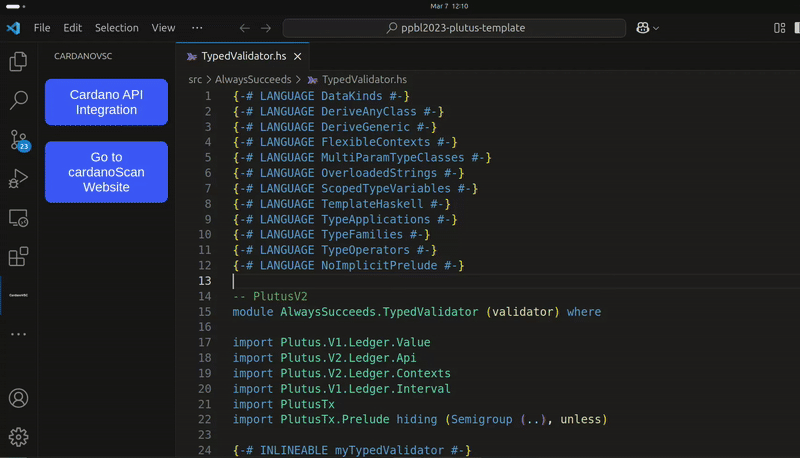
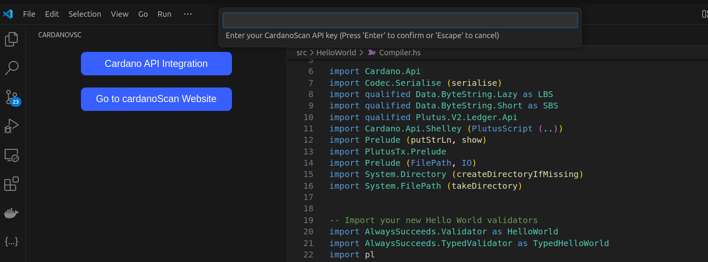
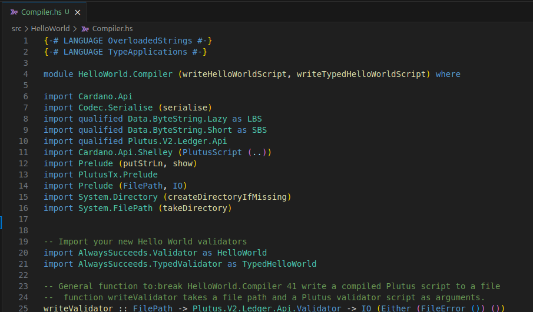

# ⚡ CardanoVSC 🚀

## ✨ Features

CardanoVSC is a powerful Visual Studio Code extension that provides seamless support for Haskell and Plutus development. It is designed to enhance developer productivity by offering:

- Advanced syntax highlighting for Haskell and Plutus code.
- Intelligent code completion to speed up development.
- Integration with the Cardano API for real-time blockchain interaction.
- An intuitive "Ctrl + Shift + P >> CardanoAPI" feature allowing developers to quickly access Cardano API options directly from the IDE.

This extension is perfect for developers building on the Cardano blockchain, enabling smooth and efficient smart contract development within the Visual Studio Code ecosystem.

## 📥 Installation

1. Clone the repository:
   ```sh
   git clone https://github.com/AIQUANT-Tech/CardanoVSC.git
   cd CardanoVSC/cardanovsc/
   ```
2. Install dependencies:
   ```sh
   npm install
   ```
3. Debug the extension by clicking the VS Code debug icon.


## 🏗️ Development

### ✅ Running Tests
Before running the test command, ensure the required test file exists:

Create a folder `out/test/` if it does not exist and add the following file `sample.hs`:
 

```haskell
module Sample where

import Data.List

factorial :: Integer -> Integer
factorial 0 = 1
factorial n = n * factorial (n - 1)

main :: IO ()
main = print (factorial 5)
```

To run tests:
```sh
npm run test
```

## 🛠️ Usage
### cardanovsc extension's sidebar webview
The Webview in CardanoVSC provides a dedicated sidebar interface within Visual Studio Code, offering a centralized hub for blockchain api interactions , development tools .


### 📜 Commands
CardanoVSC provides several commands to interact with the Cardano blockchain:
- `cardanovsc.get_latest_block_details` - Get details of the latest block.
- `cardanovsc.get_block_details` - Fetch details of a specific block.
- `cardanovsc.get_address_balance` - Retrieve balance for a given address.
- `cardanovsc.get_pool_details` - Fetch details about a stake pool.
- `cardanovsc.get_transaction_details` - Retrieve information about a transaction.

To access these commands, open the Command Palette (`Ctrl+Shift+P`), type `CardanoVSC`, and select the desired command.




## 🔗 API Integration
CardanoVSC integrates with Cardano APIs using cardanoscan API keys. 
CardanoVSC integrates with the Cardano API to provide real-time blockchain interaction directly within the IDE. Developers can fetch blockchain data, such as block details, transaction information, and wallet balances, without leaving Visual Studio Code. The API integration is powered by Cardanoscan API keys, ensuring secure and efficient access to Cardano blockchain data.


## 🔗 Auto Completion
The Auto Completion feature in CardanoVSC enhances developer productivity by providing intelligent code suggestions as you type. It supports Haskell and Plutus syntax, offering context-aware recommendations for functions, variables, and modules. This feature reduces errors and speeds up coding by predicting and completing code snippets, making it easier to write complex smart contracts and blockchain-related logic.


## 🔗 syntax highlighting
The Syntax Highlighting feature improves code readability by visually distinguishing different elements of Haskell and Plutus code. Keywords, functions, variables, and operators are color-coded, making it easier to identify and debug code. This feature is particularly useful for developers working on complex smart contracts, as it helps maintain clarity and structure in the codebase.



## 🤝 Contributing
Contributions are welcome! Please open an issue or pull request on GitHub.

## 📜 License
This project is licensed under the MIT License.

## 📌Scope and Design Documentation

- **Scope and Design Document:** https://github.com/AIQUANT-Tech/CardanoVSC/blob/main/DesignDocs/CardanoVSC-Scope_Design_Document.pdf
- **Figma Design:** https://www.figma.com/design/MiVmXAtePUc3UndaGl7eGK

